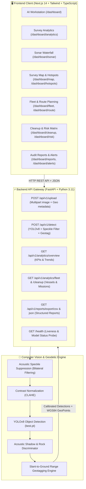

# GhostNet 🌊 — Autonomous Sonar Intelligence & Debris Detection

> **End-to-End Deep Learning & Hydrographic Survey Platform for Ghost Fishing Gear & Marine Debris Detection via Side-Scan Sonar (SSS) Imagery (Smart India Hackathon).**

[](https://nextjs.org/)
[](https://fastapi.tiangolo.com/)
[](https://pytorch.org/)
[](https://huggingface.co/zzephyrr/GhostNetyolo26m)
[](https://www.typescriptlang.org/)
[](https://tailwindcss.com/)

---

## 🌟 Complete Feature Catalog

GhostNet provides a comprehensive suite of 14 integrated hydrographic modules designed for marine technologists, AUV operators, and ocean cleanup missions:

| Feature Module | Route | Purpose & Functionality |
| :--- | :--- | :--- |
| **1. AI Sonar Workstation** | `/dashboard` | The core computer vision workspace. Upload raw side-scan sonar frames (PNG, JPG, TIFF) or select preloaded scans. Runs YOLOv8 inference, highlights detected ghost nets/lines with interactive bounding boxes, allows dynamic confidence threshold adjustments (10%–95%), provides 3-axis geotags (Lat, Lon, Depth, Area in m²), Human-in-the-Loop validation (`Confirm`/`Reject`), and one-click JSON/CSV export. |
| **2. Survey Analytics** | `/dashboard/analytics` | High-level telemetry and KPI monitoring. Integrated with `GET /api/v1/analytics/overview`. Features monthly detection trends (actual vs. target), debris mass breakdown (Ghost Nets, Synthetic Ropes, Traps & Cages, Trawl Doors), resolution percentages, active swath coverage area, and recent survey log. |
| **3. Sonar Hydrography Console** | `/dashboard/sonar` | Real-time dual-swath acoustic waterfall spectrogram. Features HTML5 2D canvas waterfall stream with live ping counter, waveform amplitude oscilloscope, gain sensitivity slider, swath width adjustment, and multi-palette colormaps (Cyan, Emerald, Amber, Thermal). |
| **4. Live Detections Feed** | `/dashboard/detections` | Real-time tactical feed of detected seafloor targets. Supports search, severity filters (*Critical*, *High*, *Medium*), geotag readouts, and an interactive 3-state mission dispatch cycler (`Unassigned` → `Mission Dispatched` → `Cleared`). |
| **5. Geospatial Survey Map** | `/dashboard/map` | Georeferenced hydrographic map showing underwater contour curves, surveyed corridors, and anomaly clusters. Includes sector switching, layer filters (*Debris*, *Bathymetry*, *Corridors*), and vessel dispatch routing. |
| **6. Debris Hotspots** | `/dashboard/hotspots` | Spatial density clustering engine. Supports clustering algorithms (*HDBSCAN*, *DBSCAN*, *K-Means*, *Gaussian KDE*), density threshold filters, heat kernel radius tuning, and cluster dossier inspection with direct salvage mission dispatch. |
| **7. Fleet Operations** | `/dashboard/fleet` | Real-time telemetry tracking for survey vessels and autonomous submersibles (RV-OCEANUS, AUV-NEPTUNE-02, ROV-TRITON-X). Displays position, speed over ground, depth, battery level, transducer frequency, and provides an interactive "Transmit Sonar Waypoint Command" interface. |
| **8. Autonomous Route Planning** | `/dashboard/route` | Lawnmower trajectory and swath generator for AUVs and survey ships. Features track spacing slider (0.5 to 3.0 NM), Eulerian drift compensation toggle, GPX waypoint file export, and "Transmit Autopilot Mission" command. |
| **9. Cleanup Missions** | `/dashboard/cleanup` | Interactive 4-stage Kanban pipeline for salvage operations (`Identified` → `Dispatched` → `In Recovery` → `Cleared`). Features drag-less stage advancement, live total target mass calculation in tonnes, and priority badge categorization. |
| **10. Risk Intelligence Matrix** | `/dashboard/risk` | Ecological threat and navigation hazard scoring engine. Analyzes mammal collision probability, propeller fouling risk, barrier reef proximity, and allows triggering a simulated NAVTEX warning broadcast to commercial maritime traffic. |
| **11. Sonar Temporal Comparison** | `/dashboard/comparison` | Dual-epoch differential acoustic overlay (Epoch A vs. Epoch B). Features an interactive split-slider comparing historical vs. current surveys, calculates net drift velocity vectors (NM/day), detects newly snagged gear, and exports Differential GeoTIFF vector files. |
| **12. Depth & Bathymetry Matrix** | `/dashboard/depth` | Multibeam acoustic backscatter and thermocline water column slicing. Features an interactive depth slicing plane slider (0m to -200m), seabed topography visualization, strata layer toggles (Epipelagic, Mesopelagic, Bathypelagic, Abyssal), transducer calibration, and pointcloud CSV download. |
| **13. Audit Logs & Reports** | `/dashboard/reports` | Comprehensive audit trail powered by `GET /api/v1/reports`. Search by report ID or summary, filter by severity, view incident breakdowns, and export selected or all records as formatted CSV and JSON reports. |
| **14. Alert Center** | `/dashboard/alerts` | Active warning center for high-priority underwater snag anomalies and dark vessel drifting. Derives dynamic active/critical counts, allows acknowledgment and resolution workflows, and links directly to tactical mapping. |

---

## 🏛️ System Architecture



---

## 🚀 Local Development & Quickstart

### Prerequisites
- Node.js 18+ & npm
- Python 3.10 or 3.11

### 1. Run the FastAPI Backend (Port 8000)
```bash
cd backend

# Create & activate virtual environment (optional but recommended)
python -m venv venv
# Windows:
venv\Scripts\activate
# Linux/macOS:
source venv/bin/activate

# Install dependencies
pip install -r requirements.txt

# Start backend dev server
python -m uvicorn app.main:app --port 8000 --reload
```
- Health Check: `http://localhost:8000/health`
- Swagger Interactive Docs: `http://localhost:8000/docs`

### 2. Run the Next.js Frontend (Port 3000)
```bash
cd frontend

# Install dependencies
npm install

# Start Next.js development server
npm run dev
```
- Open your browser at: **[http://localhost:3000](http://localhost:3000)**

---

## 🌐 Production Deployment Guide

### Part A: Deploying Backend on Render

1. **Push your code to GitHub**: Ensure the repository contains the `backend/` folder, `Dockerfile`, and `render.yaml`.
2. **Create a new Web Service on Render**:
   - Go to [dashboard.render.com](https://dashboard.render.com) and click **New +** → **Web Service**.
   - Connect your GitHub repository.
   - Configure the service:
     - **Name**: `ghostnet-backend`
     - **Root Directory**: `backend`
     - **Runtime**: `Docker` (Render will automatically detect `backend/Dockerfile`)
     - **Instance Type**: `Starter` (or `Standard` for faster PyTorch CPU inference)
3. **Set Environment Variables in Render**:
   Under the **Environment** tab, configure:
   - `ENVIRONMENT`: `production`
   - `PORT`: `8000`
   - `ALLOWED_ORIGINS`: `https://<your-vercel-app>.vercel.app,http://localhost:3000` *(update after creating Vercel app)*
   - `MODEL_REPO`: `zzephyrr/GhostNetyolo26m`
   - `CONF_THRESHOLD`: `0.25`
4. **Health Check Path**: Set **Health Check Path** to `/health`.
5. Click **Create Web Service**. Once deployed, copy your Render URL (e.g. `https://ghostnet-backend.onrender.com`).

---

### Part B: Deploying Frontend on Vercel

1. **Log in to Vercel**: Go to [vercel.com](https://vercel.com) and click **Add New...** → **Project**.
2. **Import Git Repository**: Select your GhostNet GitHub repository.
3. **Configure Project Settings**:
   - **Framework Preset**: `Next.js`
   - **Root Directory**: Click *Edit* and select **`frontend`**.
   - **Build Command**: `next build` (default)
   - **Output Directory**: `.next` (default)
4. **Add Environment Variables**:
   Under **Environment Variables**, add:
   - `NEXT_PUBLIC_API_URL`: `https://ghostnet-backend.onrender.com` *(your Render backend URL from Part A)*
5. Click **Deploy**. Vercel will build the frontend bundle and give you a live domain (e.g., `https://ghostnet.vercel.app`).
6. **Update CORS in Render**: Return to Render, add your new Vercel domain to `ALLOWED_ORIGINS`, and redeploy backend if needed.

---

## 📄 License & Attribution
Developed for the **Smart India Hackathon** — Marine Environmental Protection & Autonomous Ocean Cleanup.
